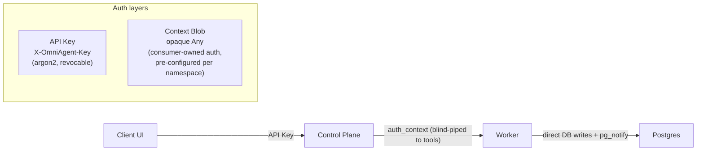
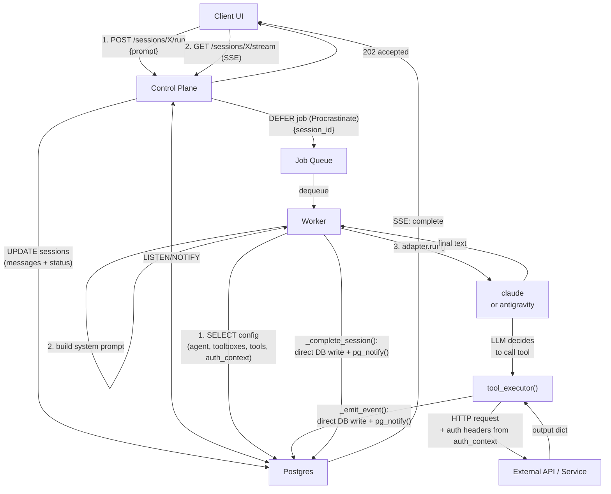
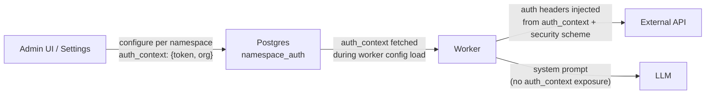
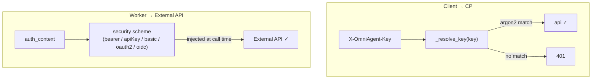

# OmniAgent

[](LICENSE)

Self-hosted platform for running AI agents across multiple LLM providers. Import any OpenAPI spec as tools and OmniAgent handles auth, routing, and execution. Use the built-in UI or hit the REST API.

---

## Architecture

### Identity & auth layers

OmniAgent authenticates at every hop — zero-trust even on internal networks.



### Execution flow



### Context forwarding (identity + personalization)

`auth_context` is pre-configured per namespace in the `namespace_auth` table. It's blind-piped to tools only — LLM never sees it. OmniAgent never reads it.



### Auth verification



### Data flow by component

| Component | Reads from | Writes to |
|-----------|-----------|-----------|
| **UI** | Control Plane (REST + SSE) | Control Plane (REST) |
| **Control Plane** | Postgres (config, sessions) | Postgres, Procrastinate (jobs) |
| **Worker** | Postgres (config), Procrastinate (jobs) | External APIs, Postgres (direct writes + pg_notify) |
| **Postgres** | CP (session/config writes), Worker (tool_calls, status) | CP (LISTEN/NOTIFY → SSE → UI) |

**Hierarchy:** `Tool` (OpenAPI import) → `Toolbox` (config, group of tools) → `Agent` (config) → `Session` (runtime)
**Observability:** JSON structured logs with trace-id correlation (`/metrics` exposes Prometheus counters + histograms).
**SSE events:** `running`, `thinking`, `tool_call`, `tool_result`, `system_prompt`, `cancelling`, `cancelled`, `deferred`, `complete`, `error`.

---

## Prerequisites

- Python 3.14+
- PostgreSQL 16+
- [uv](https://docs.astral.sh/uv/)

---

## Quick Start

### 1. Clone and configure

```bash
git clone <repo>
cd omniagent
cp .env.example .env
# Edit .env — at minimum set UI_PASSWORD and OMNIAGENT_ENCRYPTION_KEY

# Set up provider keys (pick the harnesses you use)
cp .env.claude.example .env.claude      # ANTHROPIC_* vars
cp .env.antigravity.example .env.antigravity  # ANTIGRAVITY_API_KEY
# Edit the files you need — create empty files for unused providers
```

**All services:** `DATABASE_URL`, `LOG_LEVEL`

**API:** `UI_PASSWORD`, `OMNIAGENT_ENCRYPTION_KEY`

**Worker:** `WORKER_CONCURRENCY`, `MAX_HISTORY_TURNS`, `TOOL_EXECUTION_TIMEOUT`, `MONTY_EXECUTION_TIMEOUT`, `MONTY_EXECUTOR_WORKERS`, `LANGFUSE_SECRET_KEY`, `LANGFUSE_PUBLIC_KEY`, `LANGFUSE_BASE_URL`

Provider keys live in `.env.claude` and `.env.antigravity` — see the `.example` files.

### 3. Start infrastructure

```bash
docker compose up -d
```

Starts Postgres, control plane (runs migrations), worker, and nginx. Add `-f docker-compose.test.yml` for local test service or `-f docker-compose.langfuse.yml` for self-hosted tracing.

### 4. Open the UI

`http://localhost:8080/`. Log in with your `UI_PASSWORD`.

**Manual dev (without Docker):** `uv sync && uv run uvicorn omniagent.api.main:app --host 0.0.0.0 --port 8080` for CP, `uv run python -m omniagent.worker` for worker. Docker compose handles both.

### 5. Create an API key (optional)

Only needed for programmatic API access (curl, custom UIs, bots). Go to Settings → API Keys → Create. The UI works without one — session cookie from login handles auth.

---

## Scaling

API and worker are independently scalable — run more instances of either. Control plane handles multiple replicas via `pg_try_advisory_lock` for singleton ops (migrations, reconciliation). Workers poll the job queue independently — no coordination between them.

---

## Import tools from an OpenAPI spec

Paste any OpenAPI 3.x spec in the UI (Tools → Import) — every endpoint becomes a callable tool. Manage toolboxes, agents, and sessions from the same UI at `http://localhost:8080/`.

---

## Auth for OpenAPI tools

OmniAgent reads security schemes from the spec and injects credentials at call time. All standard types supported: bearer, basic, apiKey, OAuth2 (client credentials, auth code, refresh), OpenID Connect. Cached + auto-refreshed. Configure via UI → Namespaces → Auth.

---

## API overview

| Endpoint | Purpose |
|---|---|
| `POST /tools/import-openapi` | Import spec |
| `POST /sessions` | Create session |
| `POST /sessions/{id}/run` | Send message |
| `GET /sessions/{id}/stream` | SSE event stream |
| `POST /sessions/{id}/cancel` | Cancel in-flight turn |

Multi-message queueing: send while busy — messages append durably, picked up when current turn finishes. Cancel only stops the in-flight response; queued messages continue normally.

Full REST API at `/docs`.

---

## Monty (sandboxed code execution)

Set `use_monty: true` on an agent to enable sandboxed Python execution. The agent gains an `execute_python` tool — code runs in Monty's interpreter with your registered tools available as plain Python functions. The LLM writes a single Python block, calls tools, and returns the result. No containers needed, 0.004ms sandbox startup.

